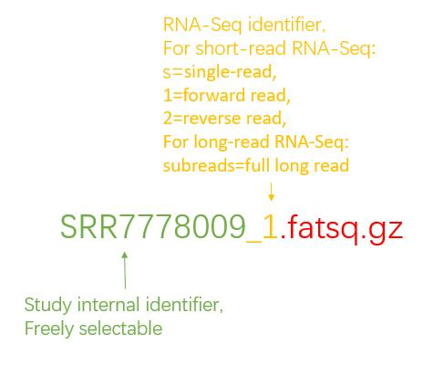

<p align="center">

</p>

annotation_smk is a simple process of genome structure annotation, which can be parallelized and automated. <br>

！[pipeline](images/pipeline.png)

## Dependencies
* [conda](https://conda.io/en/latest/index.html) <br>
Conda can be downloaded as part of the [Anaconda](https://www.anaconda.com/) or the [Miniconda](https://conda.io/en/latest/miniconda.html) plattforms (Python 3.7). <br>

## Install
```Bash
$ git clone https://github.com/yanhui-k/annotation_smk.git
``` 

## Getting Started
You can use the accompanying `environment.yaml` to creat a general conda envirment <br>
```Bash
$ mamba env create -f config/environment.yaml
``` <br>
This will create a conda environment containing all dependencies for Snakemake itself.

Activate the environment <br>
```Bash
$ conda activate annotation
``` 

## Tutorial

### Prerequisites: dataset
The FASTQ files of RNA-seq need to follow a specific naming convention:<br>
<p align="center">

</p>

```  
samplename1_1.fastq.gz  
samplename1_2.fastq.gz
samplename2_subreads.fastq.gz
```

All RNA-Seq data should be stored in a folder named base name (freely named, and will be used in the command).

### Running annotation with the "annotation_smk.sh" script

Frist, you need to add executable permission to the "annotation_smk.sh" script and activate the snakemake environment:<br>
```Bash
$ chmod +x annotation_smk.sh
$ conda activate annotation
```

Then you can start the pipeline by typing in the following commands into your terminal emulator:<br>
```Bash
$ ./annotation.sh -c <core> -b <base> -g <genome> -p <protein>
```

For example, gene annotation for *tora/tora.fa*, there is homologous protein evidence *arath_med_sprot.pep* and RNA-Seq evidence stored in the *tora* folder, if you want to use 10 cores, submit it to the cluster with bsub for execution, you can use the following  order:<br>
```Bash
$ ./annotation.sh -c 10 -b tora -g tora/tora.fa -p tora/arath_med_sprot.pep
```

### Running annotation_smk manuall
You have to start by activating the snakemake environment:<br>
```Bash
$ conda activate annotation
```

Use the following code to modify the path of the input file <br>
```Bash
$ vim config/config.yaml
``` 

Modify the value of PREFIX to the base name, modify the value of REF to the indirect path of the genome file, modify the value of PEP to the indirect path of the homologous protein evidence, and then save the file.

To start the main pipeline, type in: <br>
```Bash
$ nohup snakemake --cluster "bsub -o output -e error -q Q104C512G_X4 -m yi02" -j 10 -p --use-conda &
``` 

If you want to terminate a running pipline, please type in: <br>
```Bash
$ killall -TERM snakemake
``` 

## Output
After the workflow is finished, the files created during the workflow can be found under result/<base>/.

## Steps of the Pipeline
