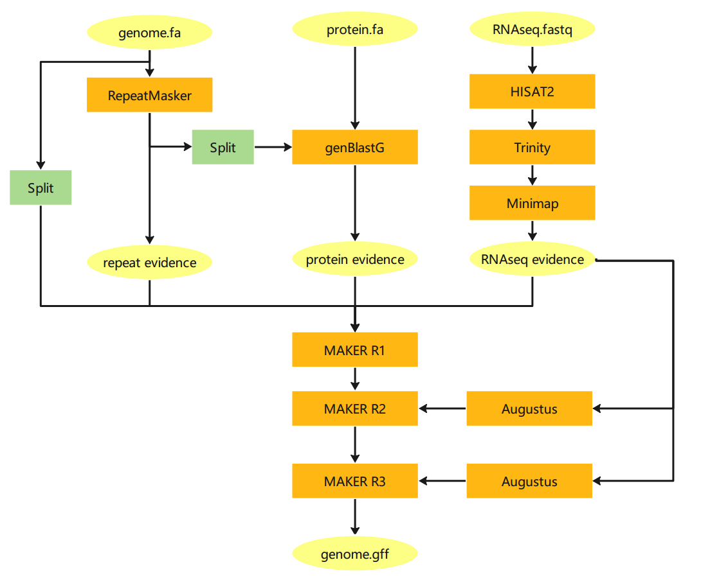
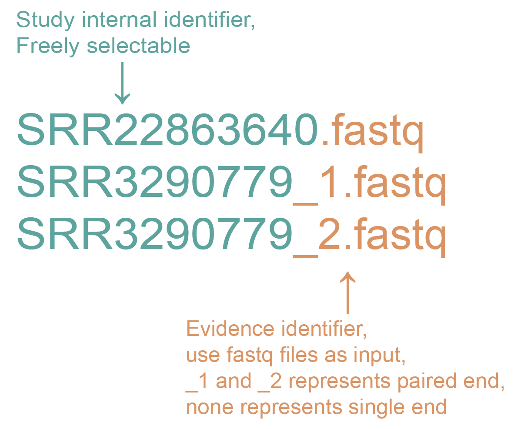
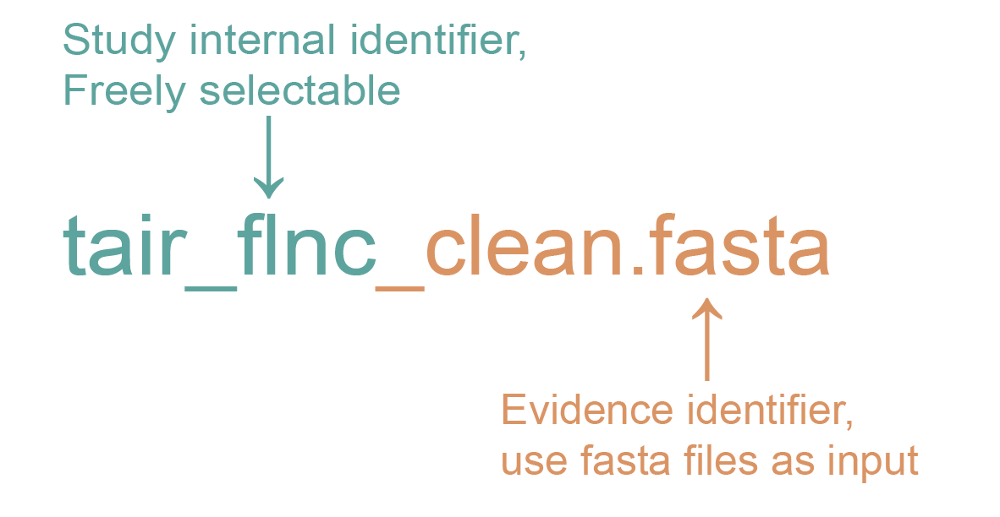

<div align=center>
 
</div>

AnnoSmk is a simple process of genome structure annotation, which can be parallelized and automated. 



## Dependencies

- [conda](https://conda.io/en/latest/index.html) 

Conda can be downloaded as part of the [Anaconda](https://www.anaconda.com/) or the [Miniconda](https://conda.io/en/latest/miniconda.html) plattforms (Python 3.7). 

## Install

```bash
$ git clone https://github.com/yanhui-k/AnnoSmk.git
```

## Getting Started

It is important to make AnnoSmk executable by typing `chmod a+x /path/to/AnnoSmk`and 
add it to you `$PATH` environment：

```python
chmod a+x /path/to/AnnoSmk
export PATH=/path/to/AnnoSmk/:/path/to/AnnoSmk/bin:$PATH
```

You can use the accompanying `config/environment.yaml` to creat a general conda envirment and use `config/requirements.txt` to download the necessary python packages.

```bash
$ mamba env create -f /path/to/AnnoSmk/config/environment.yaml
$ pip install -r /path/to/AnnoSmk/config/requirements.txt
```

This will create a conda environment containing all dependencies for Snakemake itself.

## Tutorial

### Prerequisites: dataset

The FASTQ files of RNA-seq need to follow a specific naming convention:

for RNA-Seq generated by next-generation sequencing technology:



for full-length transcripts generated by the latest third-generation sequencing technology:



For example, under the folder `tora`

```
samplename1_1.fastq.gz  
samplename1_2.fastq.gz
samplename2_s.fastq.gz
samplename3_subreads.fasta
```

Note: All RNA-Seq data should be stored in a folder named base name (freely named, and will be used in the command).

The FASTA of protein evidence is also required to improve annotation accuracy. You can download homologous protein sequence from the website [uniprot](https://www.uniprot.org/), and merge them into a FASTA format file and provide it to AnnoSmk. 

### Running AnnoSmk

Frist, you need to add executable permission to the "AnnoSmk" script and activate the snakemake environment:

```bash
$ conda activate annotation
```

Then you can start the pipeline by typing in the following commands into your terminal emulator:

```bash
$ AnnoSmk -c <CORE> -b <PREFIX> -g <REF> -p <PEP>
```

For example, gene annotation for _tora/tora.fa_, there is homologous protein evidence _arath_med_sprot.pep_ and RNA-Seq evidence stored in the _tora_ folder, if you want to use 10 cores,  you can use the following  order:

```bash
$ AnnoSmk -c 10 -b tora -g tora/tora.fa -p tora/arath_med_sprot.pep
```

Do not start the input file with ./, this is redundant and strongly discouraged. You can simply omit the './' for relative file paths.

AnnoSmk can make use of **cluster** engines that support shell scripts and have access to a common filesystem, (e.g. LSF). In this case, you can uuse the following order to run AnnoSmk:

```bash
$ AnnoSmk -c <core> -b <base> -g <genome> -p <protein> --cluster <cluster> -q <queue> -m <host>
```
You can use the following order to submit the above example to the cluster with bsub for execution:
```bash
$ AnnoSmk -c 10 -b tora -g tora/tora.fa -p tora/arath_med_sprot.pep --cluster bsub -q Q104C512G_X4 -m yi02
```
You can use the following order to submit the above example to the cluster with sbatch for execution:
```bash
$ AnnoSmk -c 10 -b tair -g ~/test_annotation_smk/test/TAIR10_chr_all.fas -p tair/Tracheophyta_uniprot_odb10.fa --cluster sbatch -q kshctest
```

### Running AnnoSmk manuall

You have to start by activating the snakemake environment:

```bash
$ conda activate annotation
```

Use the following code to modify the path of the input file 

```bash
$ vim config/config.yaml
```

Modify the value of PREFIX to the base name, modify the value of REF to the indirect path of the genome file, modify the value of PEP to the indirect path of the homologous protein evidence, and then save the file.

Use the following code to modify the steps that you want to take

```bash
$ vim /path/to/AnnoSmk/config/parameter.yaml
```

To start the main pipeline, type in: 

```bash
$ nohup snakemake -c10 -p --use-conda &
## or submit the job to a cluster engine (such as LSF):
$ nohup snakemake --cluster "bsub -o output -e error -q Q104C512G_X4 -m yi02" -j 10 -p --use-conda &
```

If you want to terminate a running pipline, please type in: 

```bash
$ killall -TERM snakemake
```

## Output

After the workflow is finished, the files created during the workflow can be found under result/_base_name_/.

## Steps of the Pipeline
